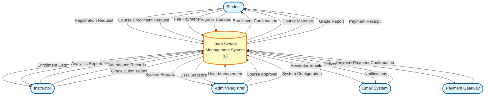
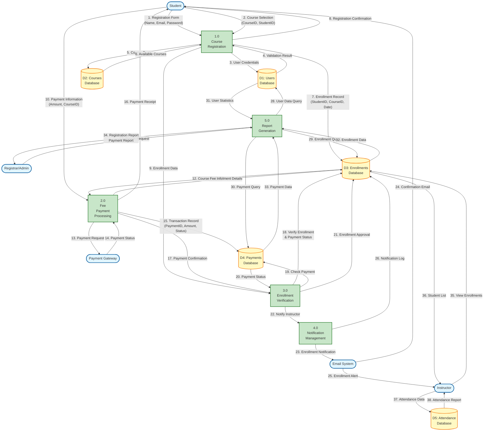
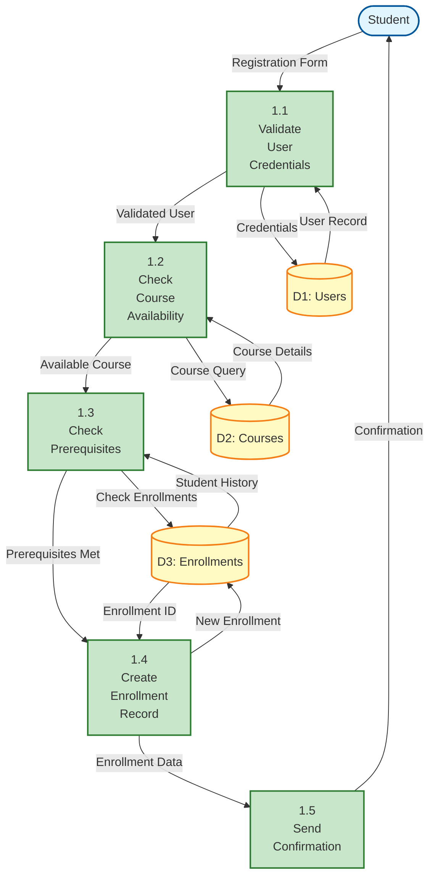
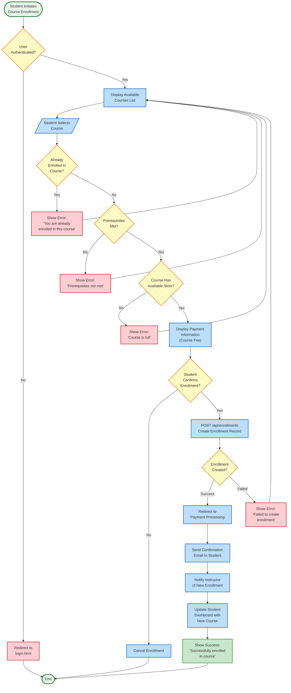
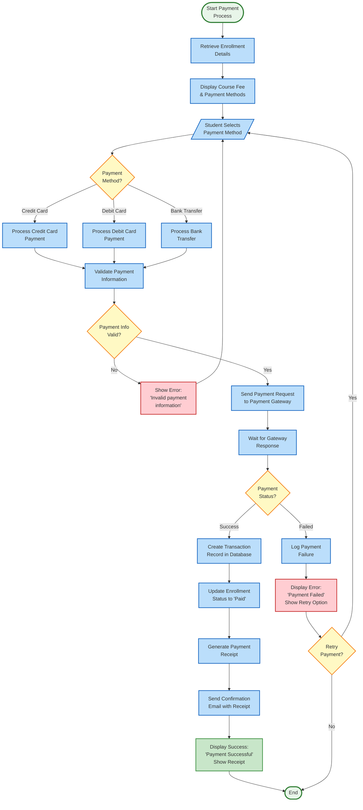
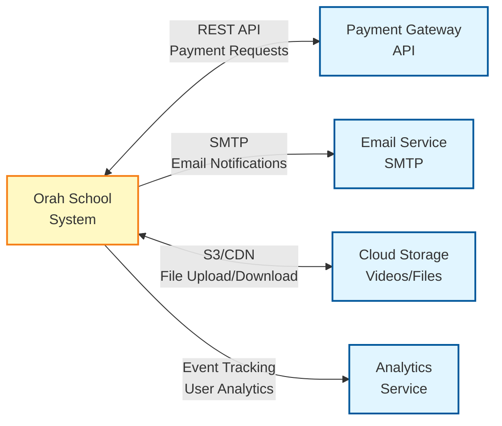

# 📊 Orah School - Data Flow Diagrams & Flowcharts

## Project Information
**Project Name:** Orah School Learning Management System  
**System Focus:** Registrar's Office - Course Registration & Fee Payment  
**Date:** December 17, 2025  
**Version:** 1.0

---

## 1. Level 0 Context Diagram (System Overview)

### Description
The Level 0 Context Diagram shows the Orah School Management System as a single process with external entities and major data flows.

### Mermaid.js Code:



### External Entities:
1. **Student** - Enrolls in courses, makes payments, views progress
2. **Instructor** - Creates courses, marks attendance, submits grades
3. **Admin/Registrar** - Manages users, approves courses, configures system
4. **Email System** - Sends reminders and notifications
5. **Payment Gateway** - Processes fee payments

---

## 2. Level 1 DFD (Course Registration & Fee Payment Focus)

### Description
The Level 1 DFD expands the Orah School System into major subsystems, focusing on Course Registration and Fee Payment processes within the Registrar's Office.

### Mermaid.js Code:



### Process Descriptions:

#### 1.0 Course Registration
- **Input:** Registration form, course selection
- **Output:** Enrollment confirmation, enrollment record
- **Description:** Validates student credentials, checks course availability, creates enrollment record

#### 2.0 Fee Payment Processing
- **Input:** Payment information, course details
- **Output:** Payment receipt, transaction record
- **Description:** Processes course fee payments through payment gateway, records transactions

#### 3.0 Enrollment Verification
- **Input:** Enrollment data, payment confirmation
- **Output:** Enrollment approval, instructor notification
- **Description:** Verifies enrollment and payment status, approves final enrollment

#### 4.0 Notification Management
- **Input:** Enrollment approval, payment confirmation
- **Output:** Confirmation emails, enrollment alerts
- **Description:** Sends email notifications to students and instructors

#### 5.0 Report Generation
- **Input:** Report request from registrar
- **Output:** Registration reports, payment reports
- **Description:** Generates statistical and financial reports for administration

---

## 3. Level 2 DFD - Course Registration (Detailed Breakdown)

### Description
Further breakdown of the Course Registration process (Process 1.0).

### Mermaid.js Code:



---

## 4. Flowchart: Login Validation with Retry Logic

### Description
Flowchart showing the login validation process with a retry mechanism after 3 failed attempts.

### Mermaid.js Code:

```mermaid
flowchart TD
    Start([Start Login Process])
    Input[/"Enter Email & Password"/]
    InitCounter["Initialize:<br/>attemptCount = 0<br/>maxAttempts = 3"]
    
    CheckEmpty{"Email or Password<br/>Empty?"}
    EmptyError["Display Error:<br/>'Please fill all fields'"]
    
    IncrementCounter["attemptCount = attemptCount + 1"]
    
    ValidateCredentials["Send credentials to<br/>POST /api/auth/login"]
    
    CheckResponse{"Authentication<br/>Successful?"}
    
    StoreToken["Store JWT Token<br/>& User Data in<br/>localStorage"]
    
    GetRole["Get User Role<br/>from Response"]
    
    CheckRole{"User Role?"}
    
    StudentDash["Redirect to<br/>student-dashboard.html"]
    InstructorDash["Redirect to<br/>instructor-hub.html"]
    AdminDash["Redirect to<br/>admin-dashboard.html"]
    
    CheckAttempts{"attemptCount >= 3?"}
    
    InvalidError["Display Error:<br/>'Invalid email or password'<br/>Show Attempts Remaining"]
    
    LockoutError["Display Error:<br/>'Account locked after 3<br/>failed attempts'<br/>Show 'Please try again in 15 minutes'"]
    
    LockAccount["Temporarily Lock Account<br/>lockUntil = currentTime + 15 min"]
    
    ShowRetry["Show 'Try Again' Button<br/>Display attempts: (3 - attemptCount)"]
    
    End([End])
    
    %% Main Flow
    Start --> Input
    Input --> InitCounter
    InitCounter --> CheckEmpty
    
    CheckEmpty -->|Yes| EmptyError
    EmptyError --> Input
    
    CheckEmpty -->|No| IncrementCounter
    IncrementCounter --> ValidateCredentials
    
    ValidateCredentials --> CheckResponse
    
    CheckResponse -->|Success| StoreToken
    StoreToken --> GetRole
    GetRole --> CheckRole
    
    CheckRole -->|"role='student'"| StudentDash
    CheckRole -->|"role='instructor'"| InstructorDash
    CheckRole -->|"role='admin'"| AdminDash
    
    StudentDash --> End
    InstructorDash --> End
    AdminDash --> End
    
    %% Failed Authentication
    CheckResponse -->|Failed| CheckAttempts
    
    CheckAttempts -->|No<br/>(attempts < 3)| InvalidError
    InvalidError --> ShowRetry
    ShowRetry --> Input
    
    CheckAttempts -->|Yes<br/>(attempts >= 3)| LockAccount
    LockAccount --> LockoutError
    LockoutError --> End
    
    %% Styling
    classDef startEndStyle fill:#e8f5e9,stroke:#2e7d32,stroke-width:3px
    classDef processStyle fill:#bbdefb,stroke:#1565c0,stroke-width:2px
    classDef decisionStyle fill:#fff9c4,stroke:#f57f17,stroke-width:2px
    classDef errorStyle fill:#ffcdd2,stroke:#c62828,stroke-width:2px
    classDef successStyle fill:#c8e6c9,stroke:#388e3c,stroke-width:2px
    
    class Start,End startEndStyle
    class Input,InitCounter,IncrementCounter,ValidateCredentials,StoreToken,GetRole,LockAccount processStyle
    class CheckEmpty,CheckResponse,CheckRole,CheckAttempts decisionStyle
    class EmptyError,InvalidError,LockoutError errorStyle
    class StudentDash,InstructorDash,AdminDash,ShowRetry successStyle
```

### Pseudocode for Login Validation:

```javascript
// Initialize variables
let attemptCount = 0;
const maxAttempts = 3;
const lockoutDuration = 15 * 60 * 1000; // 15 minutes in milliseconds

function handleLogin() {
    // Get input values
    const email = document.getElementById('email').value.trim();
    const password = document.getElementById('password').value.trim();
    
    // Check for empty fields
    if (!email || !password) {
        displayError('Please fill all fields');
        return;
    }
    
    // Increment attempt counter
    attemptCount++;
    
    // Validate credentials with backend
    fetch('http://localhost:3002/api/auth/login', {
        method: 'POST',
        headers: { 'Content-Type': 'application/json' },
        body: JSON.stringify({ email, password })
    })
    .then(response => response.json())
    .then(data => {
        if (data.ok && data.token) {
            // Success: Store token and redirect
            localStorage.setItem('token', data.token);
            localStorage.setItem('userId', data.user.userId);
            localStorage.setItem('role', data.user.role);
            
            // Role-based redirection
            if (data.user.role === 'student') {
                window.location.href = 'student-dashboard.html';
            } else if (data.user.role === 'instructor') {
                window.location.href = 'instructor-hub.html';
            } else if (data.user.role === 'admin') {
                window.location.href = 'admin-dashboard.html';
            }
        } else {
            // Failed authentication
            if (attemptCount >= maxAttempts) {
                // Lock account
                const lockUntil = Date.now() + lockoutDuration;
                localStorage.setItem('lockUntil', lockUntil);
                displayError('Account locked after 3 failed attempts. Please try again in 15 minutes.');
                disableLoginForm();
            } else {
                // Show remaining attempts
                const remainingAttempts = maxAttempts - attemptCount;
                displayError(`Invalid email or password. ${remainingAttempts} attempt(s) remaining.`);
            }
        }
    })
    .catch(error => {
        console.error('Login error:', error);
        displayError('Network error. Please try again.');
    });
}
```

---

## 5. Flowchart: Course Enrollment Process

### Mermaid.js Code:



---

## 6. Flowchart: Fee Payment Processing

### Mermaid.js Code:



---

## Data Flow Specifications

### 1. Course Registration Data Flow

| Flow # | Source | Destination | Data Elements | Description |
|--------|--------|-------------|---------------|-------------|
| 1 | Student | Registration Process | firstName, lastName, email, password | Student submits registration form |
| 2 | Student | Registration Process | courseId, studentId | Student selects course to enroll |
| 3 | Registration Process | Users DB | email, password | Check user credentials |
| 4 | Users DB | Registration Process | userId, role, name | Return validated user |
| 5 | Registration Process | Courses DB | courseId | Query course availability |
| 6 | Courses DB | Registration Process | title, capacity, enrolled | Return course details |
| 7 | Registration Process | Enrollments DB | enrollmentId, userId, courseId, date | Create enrollment record |
| 8 | Registration Process | Student | confirmationMessage, enrollmentId | Send confirmation to student |

### 2. Fee Payment Data Flow

| Flow # | Source | Destination | Data Elements | Description |
|--------|--------|-------------|---------------|-------------|
| 10 | Student | Payment Process | amount, courseId, paymentMethod | Submit payment information |
| 11 | Payment Process | Enrollments DB | courseId, userId | Query enrollment details |
| 12 | Enrollments DB | Payment Process | courseFee, enrollmentStatus | Return course fee information |
| 13 | Payment Process | Payment Gateway | amount, cardDetails, transactionId | Send payment request |
| 14 | Payment Gateway | Payment Process | status, transactionId, timestamp | Return payment status |
| 15 | Payment Process | Payments DB | paymentId, amount, status, timestamp | Store transaction record |
| 16 | Payment Process | Student | receipt, transactionId, amount | Send payment receipt |

---

## System Integration Points

### 1. External Systems Integration



---

## Key Takeaways for Registrar's Office

### Course Registration Process:
1. **Student initiates registration** → System validates credentials
2. **Course availability checked** → Prerequisites verified
3. **Enrollment record created** → Confirmation sent
4. **Payment required** → Transaction processed
5. **Final approval** → Instructor notified

### Fee Payment Process:
1. **Student selects payment method** → Information validated
2. **Request sent to payment gateway** → Real-time processing
3. **Transaction recorded** → Receipt generated
4. **Enrollment updated** → Confirmation email sent
5. **Reports generated** → Financial tracking

### Data Stores Involved:
- **D1: Users** - Student and staff information
- **D2: Courses** - Course catalog and details
- **D3: Enrollments** - Registration records
- **D4: Payments** - Financial transactions
- **D5: Attendance** - Attendance tracking

---

**Document Version:** 1.0  
**Last Updated:** December 17, 2025  
**Prepared By:** IT Systems Analyst  
**Project:** Orah School Learning Management System  
**Focus Area:** Registrar's Office - Course Registration & Fee Payment
